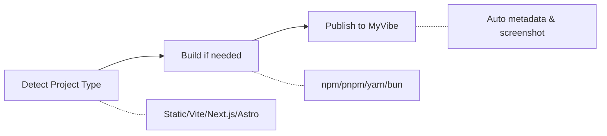

# MyVibe Skills

<p align="center">
  
</p>

<p align="center">
  
  
  
  <a href="https://github.com/ArcBlock/myvibe-skills/blob/main/LICENSE.md">
    
  </a>
  <a href="https://github.com/ArcBlock/myvibe-skills/stargazers">
    
  </a>
</p>

<p align="center">
  English | <a href="./README.zh.md">中文</a>
</p>

An AI skill that publishes your web projects to [MyVibe](https://www.myvibe.so).
Auto-detects project type, builds if needed, and deploys seamlessly.

## What is MyVibe?

[MyVibe](https://www.myvibe.so) is a platform for instantly deploying AI-generated web projects. Whether you're building with Claude Code, Cursor, Codex, Windsurf, or any other AI coding agent, MyVibe lets you publish your creations to a permanent URL in seconds.

**Key highlights:**
- Deploy in under 60 seconds
- Permanent URLs for your projects
- Support for any static web project
- Explore and discover community creations

## How it Works



## Features

| Feature | Description |
|---------|-------------|
| **Smart Detection** | Auto-detect Static, Vite, Next.js, Astro, Nuxt, Monorepo |
| **Build Integration** | Supports npm, pnpm, yarn, bun |
| **Metadata Extraction** | Title, description, tags from HTML/package.json/README |
| **Version Control** | Auto-track and update existing Vibes |
| **Cover Image** | Auto-generate screenshot as cover |
| **Tag Matching** | Smart tag suggestions from MyVibe hub |

## Installation

```bash
npx skills add ArcBlock/myvibe-skills
```

> Powered by [skills](https://github.com/vercel-labs/skills) — supports Claude Code, Cursor, Codex, Gemini CLI, and [35+ more agents](https://github.com/vercel-labs/skills#supported-agents).

Or simply tell your AI coding agent:

> Please install Skills from github.com/ArcBlock/myvibe-skills

<details>
<summary><b>Via Claude Code Plugin Marketplace</b></summary>

```bash
# Register marketplace
/plugin marketplace add ArcBlock/myvibe-skills

# Install plugin
/plugin install myvibe@myvibe-skills
```

</details>

## Quick Start

Just tell your AI assistant what you want in natural language:

```
/myvibe-publish Publish this project to MyVibe
```

```
/myvibe-publish Publish the ./dist directory to MyVibe
```

```
/myvibe-publish Publish index.html as a private Vibe
```

```
/myvibe-publish Publish the ./dist.zip file to MyVibe
```

That's it! The skill handles detection, building, and publishing automatically.

<details>
<summary><b>Advanced Options</b></summary>

You can also pass options explicitly:

| Option | Alias | Description |
|--------|-------|-------------|
| `--file <path>` | `-f` | Path to HTML file or ZIP archive |
| `--dir <path>` | `-d` | Directory to publish |
| `--hub <url>` | `-h` | MyVibe URL (default: https://www.myvibe.so/) |
| `--title <title>` | `-t` | Project title |
| `--desc <desc>` | | Project description |
| `--visibility <vis>` | `-v` | Visibility: public or private (default: public) |
| `--did <did>` | | Vibe DID for version update |
| `--new` | | Force create new Vibe, ignore history |

</details>

## FAQ

<details>
<summary><b>What types of projects can I publish?</b></summary>

Any static web project can be published, including:
- Single HTML files
- Static sites (HTML/CSS/JS)
- Built output from Vite, Next.js, Astro, Nuxt, etc.
- ZIP archives containing web content
- Projects generated by AI coding agents

</details>

<details>
<summary><b>Can I update an existing Vibe?</b></summary>

Yes! The skill automatically tracks your publish history. When you publish from the same source path, it updates the existing Vibe instead of creating a new one. Use `--new` flag to force create a new Vibe.

</details>

<details>
<summary><b>What if my project needs to be built first?</b></summary>

The skill auto-detects buildable projects (Vite, Next.js, Astro, etc.) and prompts you to build before publishing. It supports npm, pnpm, yarn, and bun package managers.

</details>

## Contributing

Contributions are welcome! Please open an [issue](https://github.com/ArcBlock/myvibe-skills/issues) or submit a pull request.

## Related Projects

- [MyVibe](https://www.myvibe.so) - AI-powered web project hosting platform

## Support

- **Issues**: [GitHub Issues](https://github.com/ArcBlock/myvibe-skills/issues)
- **MyVibe**: [www.myvibe.so](https://www.myvibe.so)

## Author

[ArcBlock](https://www.arcblock.io) - Building decentralized identity and Web3 infrastructure.

GitHub: [@ArcBlock](https://github.com/ArcBlock)

## License

[Elastic License 2.0](./LICENSE.md)
