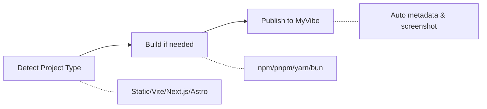

# MyVibe Skills

<p align="center">
  
  
  <a href="https://github.com/ArcBlock/myvibe-skills/blob/main/LICENSE.md">
    
  </a>
  <a href="https://github.com/ArcBlock/myvibe-skills/stargazers">
    
  </a>
</p>

<p align="center">
  English | <a href="./README.zh.md">中文</a>
</p>

Publish your web projects to [MyVibe](https://www.myvibe.so) with a single command.
Auto-detects project type, builds if needed, and deploys seamlessly.

## What is MyVibe?

[MyVibe](https://www.myvibe.so) is a platform for instantly deploying AI-generated web projects. Whether you're building with Claude, v0, Lovable, Bolt, or any other AI tool, MyVibe lets you publish your creations to a permanent URL in seconds.

**Key highlights:**
- Deploy in under 60 seconds
- Permanent URLs for your projects
- Support for any static web project
- Explore and discover community creations

## How it Works



## Features

| Feature | Description |
|---------|-------------|
| **Smart Detection** | Auto-detect Static, Vite, Next.js, Astro, Nuxt, Monorepo |
| **Build Integration** | Supports npm, pnpm, yarn, bun |
| **Metadata Extraction** | Title, description from HTML/package.json/README |
| **Version Control** | Auto-track and update existing Vibes |
| **Cover Image** | Auto-generate screenshot as cover |

## Prerequisites

- AI coding assistant with skill support (e.g., [Claude Code](https://docs.anthropic.com/en/docs/claude-code))

## Installation

### Quick Install (Recommended)

```bash
npx skills add ArcBlock/myvibe-skills
```

### Via Plugin Marketplace (Claude Code)

Run in Claude Code:

```bash
# Register marketplace
/plugin marketplace add ArcBlock/myvibe-skills

# Install plugin
/plugin install myvibe@myvibe-skills
```

### Ask the Agent

Simply tell Claude Code:

> Please install Skills from github.com/ArcBlock/myvibe-skills

## Quick Start

Just describe what you want:

```bash
/myvibe-publish Publish this project to MyVibe
```

That's it! The skill handles detection, building, and publishing automatically.

<details>
<summary><b>More Examples</b></summary>

```bash
# Publish a specific directory
/myvibe-publish Publish the ./dist directory to MyVibe

# Publish a single HTML file
/myvibe-publish Publish the ./index.html file to MyVibe

# Publish a ZIP archive
/myvibe-publish Publish the ./dist.zip file to MyVibe
```

</details>

<details>
<summary><b>Command Options</b></summary>

```bash
# Publish current directory (auto-detect project type)
/myvibe-publish

# Publish a specific directory
/myvibe-publish --dir ./dist

# Publish a ZIP file
/myvibe-publish --file ./dist.zip

# Publish a single HTML file
/myvibe-publish --file ./index.html
```

| Option | Alias | Description |
|--------|-------|-------------|
| `--file <path>` | `-f` | Path to HTML file or ZIP archive |
| `--dir <path>` | `-d` | Directory to publish |
| `--hub <url>` | `-h` | MyVibe URL (default: https://www.myvibe.so/) |
| `--title <title>` | `-t` | Project title |
| `--desc <desc>` | | Project description |
| `--visibility <vis>` | `-v` | Visibility: public or private (default: public) |
| `--did <did>` | | Vibe DID for version update |
| `--new` | | Force create new Vibe, ignore history |

</details>

## FAQ

<details>
<summary><b>What types of projects can I publish?</b></summary>

Any static web project can be published, including:
- Single HTML files
- Static sites (HTML/CSS/JS)
- Built output from Vite, Next.js, Astro, Nuxt, etc.
- ZIP archives containing web content
- Projects generated by AI tools (Claude, v0, Lovable, Bolt)

</details>

<details>
<summary><b>Can I update an existing Vibe?</b></summary>

Yes! The skill automatically tracks your publish history. When you publish from the same source path, it updates the existing Vibe instead of creating a new one. Use `--new` flag to force create a new Vibe.

</details>

<details>
<summary><b>What if my project needs to be built first?</b></summary>

The skill auto-detects buildable projects (Vite, Next.js, Astro, etc.) and prompts you to build before publishing. It supports npm, pnpm, yarn, and bun package managers.

</details>

## Related Projects

- [MyVibe](https://www.myvibe.so) - AI-powered web project hosting platform

## Support

- **Issues**: [GitHub Issues](https://github.com/ArcBlock/myvibe-skills/issues)
- **MyVibe**: [www.myvibe.so](https://www.myvibe.so)

## Author

**ArcBlock** - [blocklet@arcblock.io](mailto:blocklet@arcblock.io)

GitHub: [@ArcBlock](https://github.com/ArcBlock)

## License

[Elastic License 2.0](./LICENSE.md)
