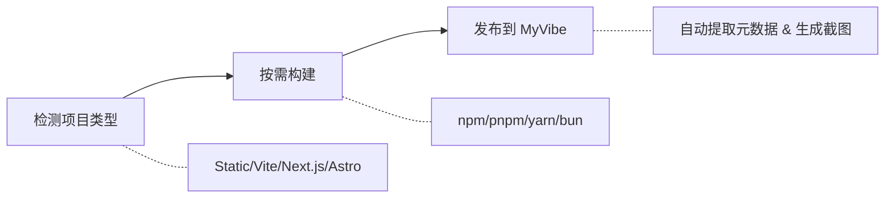

# MyVibe Skills

<p align="center">
  
</p>

<p align="center">
  
  
  <a href="https://github.com/ArcBlock/myvibe-skills/blob/main/LICENSE.md">
    
  </a>
  <a href="https://github.com/ArcBlock/myvibe-skills/stargazers">
    
  </a>
</p>

<p align="center">
  <a href="./README.md">English</a> | 中文
</p>

一个将 Web 项目发布到 [MyVibe](https://www.myvibe.so) 的 AI Skill。
自动检测项目类型、按需构建、无缝发布。

## 什么是 MyVibe？

[MyVibe](https://www.myvibe.so) 是一个即时发布 AI 生成 Web 项目的平台。无论你使用 Claude Code、Cursor、Codex、Windsurf 还是其他 AI 编程助手，MyVibe 都能让你在几秒内将作品发布到永久 URL。

**核心亮点：**
- 60 秒内完成发布
- 永久可访问的 URL
- 支持任何静态 Web 项目
- 探索和发现社区创作

## 工作原理



## 功能特性

| 特性 | 说明 |
|------|------|
| **智能检测** | 自动识别 Static、Vite、Next.js、Astro、Nuxt、Monorepo |
| **构建集成** | 支持 npm、pnpm、yarn、bun |
| **元数据提取** | 从 HTML/package.json/README 提取标题、描述和标签 |
| **版本管理** | 自动追踪并更新已发布的 Vibe |
| **封面图片** | 自动生成截图作为封面 |
| **标签匹配** | 从 MyVibe 平台智能推荐标签 |

## 安装

```bash
npx skills add ArcBlock/myvibe-skills
```

> 基于 [skills](https://github.com/vercel-labs/skills) — 支持 Claude Code、Cursor、Codex、Gemini CLI 及 [35+ 更多 Agent](https://github.com/vercel-labs/skills#supported-agents)。

或者直接告诉你的 AI 编程助手：

> 请从 github.com/ArcBlock/myvibe-skills 安装 Skills

<details>
<summary><b>通过 Claude Code 插件市场安装</b></summary>

```bash
# 注册市场
/plugin marketplace add ArcBlock/myvibe-skills

# 安装插件
/plugin install myvibe@myvibe-skills
```

</details>

## 快速开始

用自然语言告诉 AI 助手你想做什么：

```
/myvibe-publish 把这个项目发布到 MyVibe
```

```
/myvibe-publish 把 ./dist 目录发布到 MyVibe
```

```
/myvibe-publish 把 index.html 以私有方式发布
```

```
/myvibe-publish 把 ./dist.zip 文件发布到 MyVibe
```

就这么简单！Skill 会自动处理检测、构建和发布。

<details>
<summary><b>高级选项</b></summary>

你也可以显式传递参数：

| 选项 | 简写 | 说明 |
|------|------|------|
| `--file <path>` | `-f` | HTML 文件或 ZIP 压缩包路径 |
| `--dir <path>` | `-d` | 要发布的目录 |
| `--hub <url>` | `-h` | MyVibe 地址（默认：https://www.myvibe.so/）|
| `--title <title>` | `-t` | 项目标题 |
| `--desc <desc>` | | 项目描述 |
| `--visibility <vis>` | `-v` | 可见性：public 或 private（默认：public）|
| `--did <did>` | | 用于版本更新的 Vibe DID |
| `--new` | | 强制创建新 Vibe，忽略历史记录 |

</details>

## 常见问题

<details>
<summary><b>可以发布什么类型的项目？</b></summary>

任何静态 Web 项目都可以发布，包括：
- 单个 HTML 文件
- 静态站点（HTML/CSS/JS）
- Vite、Next.js、Astro、Nuxt 等框架的构建产物
- 包含 Web 内容的 ZIP 压缩包
- AI 编程助手生成的项目

</details>

<details>
<summary><b>可以更新已发布的 Vibe 吗？</b></summary>

可以！Skill 会自动追踪你的发布历史。当你从同一源路径发布时，会更新已有的 Vibe 而不是创建新的。使用 `--new` 参数可以强制创建新 Vibe。

</details>

<details>
<summary><b>如果项目需要先构建怎么办？</b></summary>

Skill 会自动检测需要构建的项目（Vite、Next.js、Astro 等），并提示你在发布前进行构建。支持 npm、pnpm、yarn 和 bun 包管理器。

</details>

## 参与贡献

欢迎贡献！请提交 [Issue](https://github.com/ArcBlock/myvibe-skills/issues) 或 Pull Request。

## 相关项目

- [MyVibe](https://www.myvibe.so) - AI 驱动的 Web 项目托管平台

## 支持

- **问题反馈**: [GitHub Issues](https://github.com/ArcBlock/myvibe-skills/issues)
- **MyVibe**: [www.myvibe.so](https://www.myvibe.so)

## 作者

[ArcBlock](https://www.arcblock.io) - 构建去中心化身份与 Web3 基础设施。

GitHub: [@ArcBlock](https://github.com/ArcBlock)

## 许可证

[Elastic License 2.0](./LICENSE.md)
